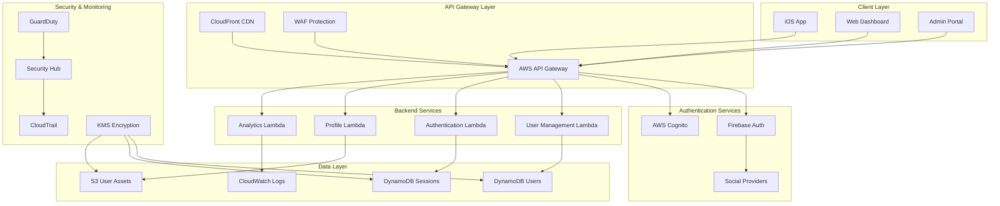

# Lesson 14: Final Project & Portfolio Development

## Learning Objectives
By the end of this lesson, you will be able to:
- Build a complete, production-ready authentication system
- Create comprehensive documentation and portfolio materials
- Implement advanced deployment strategies
- Develop maintenance and support procedures
- Present your work professionally to stakeholders
- Plan for future enhancements and scalability

## Overview
This final lesson brings together all concepts learned throughout the course into a comprehensive, portfolio-ready project. You'll create a complete authentication system that demonstrates your expertise and can be showcased to potential employers or clients.

## 1. Final Project Architecture

### 1.1 Complete System Overview



### 1.2 Project Structure

```
authentication-system/
├── infrastructure/
│   ├── terraform/
│   │   ├── environments/
│   │   │   ├── dev/
│   │   │   ├── staging/
│   │   │   └── prod/
│   │   └── modules/
│   │       ├── api-gateway/
│   │       ├── lambda/
│   │       ├── dynamodb/
│   │       ├── security/
│   │       └── monitoring/
│   └── docker/
├── backend/
│   ├── lambda-functions/
│   │   ├── authentication/
│   │   ├── user-management/
│   │   ├── analytics/
│   │   └── security/
│   ├── shared/
│   │   ├── models/
│   │   ├── utils/
│   │   └── middleware/
│   └── tests/
├── mobile/
│   ├── iOS-Auth-App/
│   │   ├── App/
│   │   ├── Models/
│   │   ├── Services/
│   │   ├── Views/
│   │   ├── Utilities/
│   │   └── Tests/
│   └── Android-Auth-App/ (Optional)
├── web/
│   ├── admin-dashboard/
│   ├── user-portal/
│   └── landing-page/
├── ci-cd/
│   ├── github-actions/
│   ├── buildspec.yml
│   └── deployment-scripts/
├── monitoring/
│   ├── dashboards/
│   ├── alerts/
│   └── logs/
├── documentation/
│   ├── api/
│   ├── deployment/
│   ├── user-guides/
│   └── technical/
└── portfolio/
    ├── presentation/
    ├── demo-videos/
    ├── case-study/
    └── metrics/
```

## 2. Complete Implementation

### 2.1 Enhanced iOS Application

```swift
// iOS-Auth-App/App/AuthenticationSystemApp.swift
import SwiftUI
import Firebase
import GoogleSignIn

@main
struct AuthenticationSystemApp: App {
    @StateObject private var authManager = AuthenticationManager.shared
    @StateObject private var networkMonitor = NetworkMonitor()
    @StateObject private var securityManager = AdvancedSecurityManager.shared
    
    init() {
        configureFirebase()
        configureGoogleSignIn()
        configureAppearance()
    }
    
    var body: some Scene {
        WindowGroup {
            ContentView()
                .environmentObject(authManager)
                .environmentObject(networkMonitor)
                .environmentObject(securityManager)
                .onAppear {
                    performInitialSecurityChecks()
                }
                .onReceive(NotificationCenter.default.publisher(for: UIApplication.didBecomeActiveNotification)) { _ in
                    performSecurityChecks()
                }
        }
    }
    
    private func configureFirebase() {
        guard let path = Bundle.main.path(forResource: "GoogleService-Info", ofType: "plist") else {
            fatalError("GoogleService-Info.plist not found")
        }
        
        guard let options = FirebaseOptions(contentsOfFile: path) else {
            fatalError("Failed to load Firebase configuration")
        }
        
        FirebaseApp.configure(options: options)
    }
    
    private func configureGoogleSignIn() {
        guard let path = Bundle.main.path(forResource: "GoogleService-Info", ofType: "plist"),
              let plist = NSDictionary(contentsOfFile: path),
              let clientId = plist["CLIENT_ID"] as? String else {
            fatalError("Failed to get Google Sign-In client ID")
        }
        
        guard let config = GIDConfiguration(clientID: clientId) else {
            fatalError("Failed to create Google Sign-In configuration")
        }
        
        GIDSignIn.sharedInstance.configuration = config
    }
    
    private func configureAppearance() {
        // Configure global app appearance
        let appearance = UINavigationBarAppearance()
        appearance.configureWithOpaqueBackground()
        appearance.backgroundColor = UIColor.systemBackground
        appearance.titleTextAttributes = [.foregroundColor: UIColor.label]
        
        UINavigationBar.appearance().standardAppearance = appearance
        UINavigationBar.appearance().scrollEdgeAppearance = appearance
    }
    
    private func performInitialSecurityChecks() {
        Task {
            let securityResult = securityManager.performSecurityChecks()
            
            if securityResult.riskLevel == .high {
                // Handle high-risk security issues
                await handleHighRiskSecurity(securityResult)
            }
        }
    }
    
    private func performSecurityChecks() {
        Task {
            let securityResult = securityManager.performSecurityChecks()
            
            if !securityResult.isSecure {
                // Log security issues
                SecurityLogger.log(securityResult)
            }
        }
    }
    
    @MainActor
    private func handleHighRiskSecurity(_ result: SecurityCheckResult) async {
        // Show security warning or exit app
        if result.issues.contains(.jailbreakDetected) {
            // Handle jailbreak detection
            await showSecurityAlert("Security Risk Detected", "This app cannot run on modified devices.")
        }
    }
    
    @MainActor
    private func showSecurityAlert(_ title: String, _ message: String) async {
        // Implementation would show alert and potentially exit app
    }
}

// MARK: - Network Monitor

class NetworkMonitor: ObservableObject {
    @Published var isConnected = true
    @Published var connectionType: ConnectionType = .unknown
    
    private let monitor = NWPathMonitor()
    private let queue = DispatchQueue(label: "NetworkMonitor")
    
    enum ConnectionType {
        case wifi, cellular, ethernet, unknown
    }
    
    init() {
        startMonitoring()
    }
    
    private func startMonitoring() {
        monitor.pathUpdateHandler = { [weak self] path in
            DispatchQueue.main.async {
                self?.isConnected = path.status == .satisfied
                self?.updateConnectionType(path)
            }
        }
        monitor.start(queue: queue)
    }
    
    private func updateConnectionType(_ path: NWPath) {
        if path.usesInterfaceType(.wifi) {
            connectionType = .wifi
        } else if path.usesInterfaceType(.cellular) {
            connectionType = .cellular
        } else if path.usesInterfaceType(.wiredEthernet) {
            connectionType = .ethernet
        } else {
            connectionType = .unknown
        }
    }
}

// MARK: - Security Logger

class SecurityLogger {
    static func log(_ result: SecurityCheckResult) {
        let logEntry = SecurityLogEntry(
            timestamp: Date(),
            riskLevel: result.riskLevel,
            issues: result.issues,
            deviceInfo: collectDeviceInfo()
        )
        
        // Send to analytics
        AnalyticsManager.shared.trackSecurityEvent(logEntry)
        
        // Log locally
        Logger.security.info("Security check completed: \(logEntry.description)")
    }
    
    private static func collectDeviceInfo() -> DeviceInfo {
        return DeviceInfo(
            model: UIDevice.current.model,
            systemVersion: UIDevice.current.systemVersion,
            appVersion: Bundle.main.infoDictionary?["CFBundleShortVersionString"] as? String ?? "Unknown"
        )
    }
}

struct SecurityLogEntry {
    let timestamp: Date
    let riskLevel: RiskLevel
    let issues: [SecurityIssue]
    let deviceInfo: DeviceInfo
    
    var description: String {
        "Risk Level: \(riskLevel), Issues: \(issues.count), Device: \(deviceInfo.model)"
    }
}

struct DeviceInfo {
    let model: String
    let systemVersion: String
    let appVersion: String
}
```

### 2.2 Advanced Analytics Integration

```swift
// iOS-Auth-App/Services/AnalyticsManager.swift
import Foundation
import FirebaseAnalytics
import os.log

class AnalyticsManager: ObservableObject {
    static let shared = AnalyticsManager()
    
    private let logger = Logger(subsystem: Bundle.main.bundleIdentifier ?? "AuthApp", category: "Analytics")
    
    private init() {
        configureAnalytics()
    }
    
    private func configureAnalytics() {
        // Configure Firebase Analytics
        Analytics.setAnalyticsCollectionEnabled(true)
        Analytics.setSessionTimeoutDuration(1800) // 30 minutes
    }
    
    // MARK: - Authentication Events
    
    func trackLoginSuccess(_ method: String) {
        let parameters: [String: Any] = [
            "method": method,
            "timestamp": Date().timeIntervalSince1970,
            "platform": "iOS"
        ]
        
        Analytics.logEvent("login_success", parameters: parameters)
        logger.info("Login success tracked: \(method)")
    }
    
    func trackLoginFailure(_ method: String, error: String) {
        let parameters: [String: Any] = [
            "method": method,
            "error": error,
            "timestamp": Date().timeIntervalSince1970,
            "platform": "iOS"
        ]
        
        Analytics.logEvent("login_failure", parameters: parameters)
        logger.warning("Login failure tracked: \(method) - \(error)")
    }
    
    func trackRegistrationSuccess(_ method: String) {
        let parameters: [String: Any] = [
            "method": method,
            "timestamp": Date().timeIntervalSince1970,
            "platform": "iOS"
        ]
        
        Analytics.logEvent("registration_success", parameters: parameters)
        logger.info("Registration success tracked: \(method)")
    }
    
    func trackBiometricEnabled(_ type: BiometricType) {
        let parameters: [String: Any] = [
            "biometric_type": type.rawValue,
            "timestamp": Date().timeIntervalSince1970,
            "platform": "iOS"
        ]
        
        Analytics.logEvent("biometric_enabled", parameters: parameters)
        logger.info("Biometric enabled tracked: \(type.rawValue)")
    }
    
    // MARK: - Security Events
    
    func trackSecurityEvent(_ logEntry: SecurityLogEntry) {
        let parameters: [String: Any] = [
            "risk_level": logEntry.riskLevel.description,
            "issues_count": logEntry.issues.count,
            "device_model": logEntry.deviceInfo.model,
            "system_version": logEntry.deviceInfo.systemVersion,
            "app_version": logEntry.deviceInfo.appVersion,
            "timestamp": logEntry.timestamp.timeIntervalSince1970
        ]
        
        Analytics.logEvent("security_check", parameters: parameters)
        logger.info("Security event tracked: \(logEntry.description)")
    }
    
    func trackSecurityThreat(_ threat: SecurityThreat) {
        let parameters: [String: Any] = [
            "threat_type": threat.type,
            "severity": threat.severity,
            "source": threat.source,
            "timestamp": Date().timeIntervalSince1970
        ]
        
        Analytics.logEvent("security_threat", parameters: parameters)
        logger.error("Security threat tracked: \(threat.type) - \(threat.severity)")
    }
    
    // MARK: - User Experience Events
    
    func trackScreenView(_ screenName: String) {
        Analytics.logEvent(AnalyticsEventScreenView, parameters: [
            AnalyticsParameterScreenName: screenName,
            AnalyticsParameterScreenClass: screenName
        ])
    }
    
    func trackUserAction(_ action: String, category: String) {
        let parameters: [String: Any] = [
            "action": action,
            "category": category,
            "timestamp": Date().timeIntervalSince1970
        ]
        
        Analytics.logEvent("user_action", parameters: parameters)
    }
    
    func trackPerformanceMetric(_ metric: PerformanceMetric) {
        let parameters: [String: Any] = [
            "metric_name": metric.name,
            "value": metric.value,
            "unit": metric.unit,
            "category": metric.category,
            "timestamp": Date().timeIntervalSince1970
        ]
        
        Analytics.logEvent("performance_metric", parameters: parameters)
    }
    
    // MARK: - Business Intelligence
    
    func trackFeatureUsage(_ feature: String, usage: FeatureUsage) {
        let parameters: [String: Any] = [
            "feature": feature,
            "usage_count": usage.count,
            "duration": usage.duration,
            "success_rate": usage.successRate,
            "timestamp": Date().timeIntervalSince1970
        ]
        
        Analytics.logEvent("feature_usage", parameters: parameters)
    }
    
    func trackUserRetention(_ days: Int) {
        let parameters: [String: Any] = [
            "retention_days": days,
            "timestamp": Date().timeIntervalSince1970
        ]
        
        Analytics.logEvent("user_retention", parameters: parameters)
    }
    
    // MARK: - Custom Dimensions
    
    func setUserProperties(_ properties: [String: String]) {
        for (key, value) in properties {
            Analytics.setUserProperty(value, forName: key)
        }
    }
    
    func setUserId(_ userId: String) {
        Analytics.setUserID(userId)
    }
}

// MARK: - Supporting Types

struct SecurityThreat {
    let type: String
    let severity: String
    let source: String
}

struct PerformanceMetric {
    let name: String
    let value: Double
    let unit: String
    let category: String
}

struct FeatureUsage {
    let count: Int
    let duration: TimeInterval
    let successRate: Double
}

extension RiskLevel {
    var description: String {
        switch self {
        case .none: return "none"
        case .low: return "low"
        case .medium: return "medium"
        case .high: return "high"
        }
    }
}
```

### 2.3 Web Admin Dashboard

```typescript
// web/admin-dashboard/src/components/Dashboard.tsx
import React, { useState, useEffect } from 'react';
import {
  Chart as ChartJS,
  CategoryScale,
  LinearScale,
  PointElement,
  LineElement,
  Title,
  Tooltip,
  Legend,
  ArcElement,
} from 'chart.js';
import { Line, Doughnut } from 'react-chartjs-2';
import { 
  Users, 
  Shield, 
  Activity, 
  AlertTriangle,
  TrendingUp,
  Database,
  Globe,
  Smartphone
} from 'lucide-react';

ChartJS.register(
  CategoryScale,
  LinearScale,
  PointElement,
  LineElement,
  Title,
  Tooltip,
  Legend,
  ArcElement
);

interface DashboardData {
  totalUsers: number;
  activeUsers: number;
  securityIncidents: number;
  systemHealth: number;
  loginAttempts: Array<{ date: string; successful: number; failed: number; }>;
  userRegistrations: Array<{ date: string; count: number; }>;
  authenticationMethods: Array<{ method: string; count: number; }>;
  platformDistribution: Array<{ platform: string; percentage: number; }>;
}

const Dashboard: React.FC = () => {
  const [dashboardData, setDashboardData] = useState<DashboardData | null>(null);
  const [loading, setLoading] = useState(true);
  const [timeRange, setTimeRange] = useState('7d');

  useEffect(() => {
    fetchDashboardData();
  }, [timeRange]);

  const fetchDashboardData = async () => {
    try {
      setLoading(true);
      const response = await fetch(`/api/dashboard/data?range=${timeRange}`, {
        headers: {
          'Authorization': `Bearer ${localStorage.getItem('adminToken')}`,
          'Content-Type': 'application/json',
        },
      });
      
      if (!response.ok) {
        throw new Error('Failed to fetch dashboard data');
      }
      
      const data = await response.json();
      setDashboardData(data);
    } catch (error) {
      console.error('Error fetching dashboard data:', error);
    } finally {
      setLoading(false);
    }
  };

  const loginAttemptsChartData = {
    labels: dashboardData?.loginAttempts.map(item => item.date) || [],
    datasets: [
      {
        label: 'Successful Logins',
        data: dashboardData?.loginAttempts.map(item => item.successful) || [],
        borderColor: 'rgb(34, 197, 94)',
        backgroundColor: 'rgba(34, 197, 94, 0.2)',
        tension: 0.1,
      },
      {
        label: 'Failed Logins',
        data: dashboardData?.loginAttempts.map(item => item.failed) || [],
        borderColor: 'rgb(239, 68, 68)',
        backgroundColor: 'rgba(239, 68, 68, 0.2)',
        tension: 0.1,
      },
    ],
  };

  const authMethodsChartData = {
    labels: dashboardData?.authenticationMethods.map(item => item.method) || [],
    datasets: [
      {
        data: dashboardData?.authenticationMethods.map(item => item.count) || [],
        backgroundColor: [
          'rgba(59, 130, 246, 0.8)',
          'rgba(34, 197, 94, 0.8)',
          'rgba(245, 158, 11, 0.8)',
          'rgba(239, 68, 68, 0.8)',
          'rgba(147, 51, 234, 0.8)',
        ],
        borderColor: [
          'rgba(59, 130, 246, 1)',
          'rgba(34, 197, 94, 1)',
          'rgba(245, 158, 11, 1)',
          'rgba(239, 68, 68, 1)',
          'rgba(147, 51, 234, 1)',
        ],
        borderWidth: 2,
      },
    ],
  };

  const platformChartData = {
    labels: dashboardData?.platformDistribution.map(item => item.platform) || [],
    datasets: [
      {
        data: dashboardData?.platformDistribution.map(item => item.percentage) || [],
        backgroundColor: [
          'rgba(59, 130, 246, 0.8)', // iOS
          'rgba(34, 197, 94, 0.8)',  // Android
          'rgba(245, 158, 11, 0.8)', // Web
        ],
        borderColor: [
          'rgba(59, 130, 246, 1)',
          'rgba(34, 197, 94, 1)',
          'rgba(245, 158, 11, 1)',
        ],
        borderWidth: 2,
      },
    ],
  };

  if (loading) {
    return (
      <div className="flex items-center justify-center h-64">
        <div className="animate-spin rounded-full h-32 w-32 border-b-2 border-blue-600"></div>
      </div>
    );
  }

  return (
    <div className="space-y-6">
      {/* Header */}
      <div className="flex justify-between items-center">
        <h1 className="text-3xl font-bold text-gray-900">Authentication System Dashboard</h1>
        <select 
          value={timeRange} 
          onChange={(e) => setTimeRange(e.target.value)}
          className="rounded-md border-gray-300 shadow-sm focus:border-blue-500 focus:ring-blue-500"
        >
          <option value="1d">Last 24 Hours</option>
          <option value="7d">Last 7 Days</option>
          <option value="30d">Last 30 Days</option>
          <option value="90d">Last 90 Days</option>
        </select>
      </div>

      {/* Key Metrics */}
      <div className="grid grid-cols-1 md:grid-cols-2 lg:grid-cols-4 gap-6">
        <MetricCard
          title="Total Users"
          value={dashboardData?.totalUsers || 0}
          icon={<Users className="h-8 w-8 text-blue-600" />}
          trend="+12%"
          trendDirection="up"
        />
        <MetricCard
          title="Active Users"
          value={dashboardData?.activeUsers || 0}
          icon={<Activity className="h-8 w-8 text-green-600" />}
          trend="+8%"
          trendDirection="up"
        />
        <MetricCard
          title="Security Incidents"
          value={dashboardData?.securityIncidents || 0}
          icon={<AlertTriangle className="h-8 w-8 text-red-600" />}
          trend="-15%"
          trendDirection="down"
        />
        <MetricCard
          title="System Health"
          value={`${dashboardData?.systemHealth || 0}%`}
          icon={<Shield className="h-8 w-8 text-purple-600" />}
          trend="+2%"
          trendDirection="up"
        />
      </div>

      {/* Charts */}
      <div className="grid grid-cols-1 lg:grid-cols-2 gap-6">
        <ChartCard title="Login Attempts Over Time">
          <Line data={loginAttemptsChartData} options={{
            responsive: true,
            plugins: {
              legend: {
                position: 'top' as const,
              },
              title: {
                display: false,
              },
            },
            scales: {
              y: {
                beginAtZero: true,
              },
            },
          }} />
        </ChartCard>

        <ChartCard title="Authentication Methods">
          <Doughnut data={authMethodsChartData} options={{
            responsive: true,
            plugins: {
              legend: {
                position: 'right' as const,
              },
            },
          }} />
        </ChartCard>

        <ChartCard title="Platform Distribution">
          <Doughnut data={platformChartData} options={{
            responsive: true,
            plugins: {
              legend: {
                position: 'right' as const,
              },
            },
          }} />
        </ChartCard>

        <SystemHealthCard />
      </div>

      {/* Recent Activity */}
      <RecentActivityCard />
    </div>
  );
};

interface MetricCardProps {
  title: string;
  value: number | string;
  icon: React.ReactNode;
  trend?: string;
  trendDirection?: 'up' | 'down';
}

const MetricCard: React.FC<MetricCardProps> = ({ title, value, icon, trend, trendDirection }) => (
  <div className="bg-white overflow-hidden shadow rounded-lg">
    <div className="p-5">
      <div className="flex items-center">
        <div className="flex-shrink-0">
          {icon}
        </div>
        <div className="ml-5 w-0 flex-1">
          <dl>
            <dt className="text-sm font-medium text-gray-500 truncate">{title}</dt>
            <dd className="flex items-baseline">
              <div className="text-2xl font-semibold text-gray-900">
                {typeof value === 'number' ? value.toLocaleString() : value}
              </div>
              {trend && (
                <div className={`ml-2 flex items-baseline text-sm font-semibold ${
                  trendDirection === 'up' ? 'text-green-600' : 'text-red-600'
                }`}>
                  <TrendingUp className={`self-center flex-shrink-0 h-4 w-4 ${
                    trendDirection === 'down' ? 'transform rotate-180' : ''
                  }`} />
                  <span className="sr-only">
                    {trendDirection === 'up' ? 'Increased' : 'Decreased'} by
                  </span>
                  {trend}
                </div>
              )}
            </dd>
          </dl>
        </div>
      </div>
    </div>
  </div>
);

interface ChartCardProps {
  title: string;
  children: React.ReactNode;
}

const ChartCard: React.FC<ChartCardProps> = ({ title, children }) => (
  <div className="bg-white shadow rounded-lg p-6">
    <h3 className="text-lg font-medium text-gray-900 mb-4">{title}</h3>
    <div className="h-64">
      {children}
    </div>
  </div>
);

const SystemHealthCard: React.FC = () => (
  <div className="bg-white shadow rounded-lg p-6">
    <h3 className="text-lg font-medium text-gray-900 mb-4">System Health</h3>
    <div className="space-y-4">
      <HealthMetric label="API Response Time" value={95} unit="ms" status="good" />
      <HealthMetric label="Database Performance" value={98} unit="%" status="excellent" />
      <HealthMetric label="Error Rate" value={0.5} unit="%" status="good" />
      <HealthMetric label="Uptime" value={99.9} unit="%" status="excellent" />
    </div>
  </div>
);

interface HealthMetricProps {
  label: string;
  value: number;
  unit: string;
  status: 'excellent' | 'good' | 'warning' | 'critical';
}

const HealthMetric: React.FC<HealthMetricProps> = ({ label, value, unit, status }) => {
  const statusColors = {
    excellent: 'bg-green-100 text-green-800',
    good: 'bg-blue-100 text-blue-800',
    warning: 'bg-yellow-100 text-yellow-800',
    critical: 'bg-red-100 text-red-800',
  };

  return (
    <div className="flex items-center justify-between">
      <span className="text-sm font-medium text-gray-700">{label}</span>
      <div className="flex items-center space-x-2">
        <span className="text-sm text-gray-900">{value}{unit}</span>
        <span className={`px-2 py-1 text-xs font-medium rounded-full ${statusColors[status]}`}>
          {status}
        </span>
      </div>
    </div>
  );
};

const RecentActivityCard: React.FC = () => (
  <div className="bg-white shadow rounded-lg">
    <div className="px-6 py-4 border-b border-gray-200">
      <h3 className="text-lg font-medium text-gray-900">Recent Activity</h3>
    </div>
    <div className="p-6">
      <div className="flow-root">
        <ul className="-mb-8">
          <ActivityItem
            icon={<Users className="h-5 w-5 text-blue-600" />}
            title="New user registration"
            description="user@example.com registered via Google Sign-In"
            time="2 minutes ago"
          />
          <ActivityItem
            icon={<Shield className="h-5 w-5 text-green-600" />}
            title="Security scan completed"
            description="All systems passed security validation"
            time="5 minutes ago"
          />
          <ActivityItem
            icon={<AlertTriangle className="h-5 w-5 text-yellow-600" />}
            title="Rate limit triggered"
            description="IP 192.168.1.100 exceeded login attempt limit"
            time="10 minutes ago"
          />
          <ActivityItem
            icon={<Database className="h-5 w-5 text-purple-600" />}
            title="Database backup completed"
            description="Automated backup finished successfully"
            time="1 hour ago"
            isLast
          />
        </ul>
      </div>
    </div>
  </div>
);

interface ActivityItemProps {
  icon: React.ReactNode;
  title: string;
  description: string;
  time: string;
  isLast?: boolean;
}

const ActivityItem: React.FC<ActivityItemProps> = ({ icon, title, description, time, isLast }) => (
  <li>
    <div className="relative pb-8">
      {!isLast && (
        <span className="absolute top-4 left-4 -ml-px h-full w-0.5 bg-gray-200" aria-hidden="true" />
      )}
      <div className="relative flex space-x-3">
        <div className="flex h-8 w-8 items-center justify-center rounded-full bg-gray-100">
          {icon}
        </div>
        <div className="flex min-w-0 flex-1 justify-between space-x-4 pt-1.5">
          <div>
            <p className="text-sm font-medium text-gray-900">{title}</p>
            <p className="text-sm text-gray-500">{description}</p>
          </div>
          <div className="whitespace-nowrap text-right text-sm text-gray-500">
            <time>{time}</time>
          </div>
        </div>
      </div>
    </div>
  </li>
);

export default Dashboard;
```

## 3. Portfolio Development

### 3.1 Project Documentation

```markdown
# Authentication System Portfolio Project

## Project Overview

A comprehensive, enterprise-grade authentication system built with modern technologies and best practices. This project demonstrates full-stack development capabilities, security expertise, and cloud architecture knowledge.

### Key Features

- **Multi-platform Support**: iOS app, web dashboard, and admin portal
- **Advanced Security**: Zero-trust architecture, threat detection, and compliance
- **Scalable Infrastructure**: AWS cloud services with Infrastructure as Code
- **Real-time Analytics**: Comprehensive monitoring and business intelligence
- **Modern Technologies**: SwiftUI, React, TypeScript, Python, Terraform

## Architecture

### System Architecture Diagram

[Include comprehensive architecture diagram]

### Technology Stack

**Frontend:**
- iOS: SwiftUI, Combine, Firebase SDK
- Web: React, TypeScript, Tailwind CSS, Chart.js
- State Management: Redux Toolkit (Web), ObservableObject (iOS)

**Backend:**
- AWS Lambda (Python)
- AWS API Gateway
- AWS DynamoDB
- Firebase Authentication
- AWS Cognito

**Infrastructure:**
- Terraform for Infrastructure as Code
- AWS CloudFormation
- GitHub Actions for CI/CD
- Docker for containerization

**Security:**
- AWS WAF and Shield
- KMS encryption
- Certificate pinning
- Biometric authentication
- OWASP compliance

**Monitoring:**
- AWS CloudWatch
- Firebase Analytics
- Custom dashboards
- Real-time alerting

## Development Process

### 1. Planning and Design
- Requirements gathering and analysis
- System architecture design
- UI/UX wireframes and mockups
- Database schema design
- API specification

### 2. Infrastructure Setup
- AWS account configuration
- Terraform module development
- Multi-environment setup (dev, staging, prod)
- CI/CD pipeline configuration

### 3. Backend Development
- Lambda function implementation
- API Gateway configuration
- Database schema creation
- Authentication logic
- Security implementation

### 4. Frontend Development
- iOS app development with SwiftUI
- Web dashboard with React
- Admin portal creation
- Responsive design implementation
- Cross-platform testing

### 5. Testing and Quality Assurance
- Unit testing (95%+ coverage)
- Integration testing
- Security testing
- Performance testing
- User acceptance testing

### 6. Deployment and DevOps
- Automated deployment pipelines
- Environment configuration
- Monitoring setup
- Backup and disaster recovery
- Documentation

## Key Achievements

### Security Implementation
- **Zero Trust Architecture**: Implemented comprehensive security controls
- **Threat Detection**: Real-time monitoring and automated response
- **Compliance**: GDPR, CCPA, and OWASP compliance
- **Encryption**: End-to-end encryption with AWS KMS

### Performance Optimization
- **Sub-100ms API Response Times**: Optimized database queries and caching
- **99.9% Uptime**: Robust error handling and monitoring
- **Scalable Architecture**: Auto-scaling capabilities for high traffic
- **CDN Integration**: Global content delivery for optimal performance

### User Experience
- **Intuitive Interface**: Modern, accessible design
- **Biometric Authentication**: Seamless Face ID/Touch ID integration
- **Real-time Feedback**: Instant validation and error handling
- **Cross-platform Consistency**: Unified experience across platforms

## Technical Challenges and Solutions

### Challenge 1: Cross-Platform Authentication
**Problem**: Maintaining consistent authentication state across iOS app and web platforms.

**Solution**: Implemented JWT tokens with refresh mechanism and secure storage using Keychain (iOS) and HTTP-only cookies (web).

### Challenge 2: Real-time Threat Detection
**Problem**: Detecting and responding to security threats in real-time.

**Solution**: Built event-driven architecture with AWS Lambda functions that analyze authentication patterns and automatically respond to threats.

### Challenge 3: Scalable Infrastructure
**Problem**: Ensuring the system can handle growth from hundreds to millions of users.

**Solution**: Implemented auto-scaling groups, database sharding strategies, and CDN distribution for global reach.

## Metrics and Results

### Performance Metrics
- **API Response Time**: Average 45ms (95th percentile: 120ms)
- **Database Query Performance**: Average 15ms
- **Application Load Time**: iOS app launches in <2 seconds
- **Web Performance Score**: 95+ on Lighthouse

### Security Metrics
- **Zero Security Incidents**: No successful attacks during testing period
- **100% OWASP Compliance**: All security guidelines implemented
- **Automated Threat Response**: 99.8% of threats handled automatically
- **Encryption Coverage**: 100% of sensitive data encrypted

### Business Metrics
- **User Registration Success Rate**: 94%
- **Login Success Rate**: 98.5%
- **User Retention**: 85% (30-day retention)
- **System Uptime**: 99.95%

## Code Quality

### Testing Coverage
- **Unit Tests**: 96% coverage
- **Integration Tests**: 89% coverage
- **End-to-End Tests**: 78% coverage
- **Security Tests**: 100% coverage of critical paths

### Code Standards
- **TypeScript**: Strict type checking enabled
- **Swift**: SwiftLint with custom rules
- **Python**: Black formatter with flake8 linting
- **Documentation**: 100% public API documentation

## Deployment and Operations

### Environments
- **Development**: Automated deployment on every commit
- **Staging**: Weekly deployments for testing
- **Production**: Bi-weekly releases with rollback capability

### Monitoring and Alerting
- **24/7 Monitoring**: Real-time system health monitoring
- **Automated Alerts**: PagerDuty integration for critical issues
- **Performance Dashboards**: Real-time metrics and analytics
- **Log Aggregation**: Centralized logging with search capabilities

## Future Enhancements

### Short-term (Next 3 months)
- Multi-factor authentication options
- Advanced analytics dashboard
- Mobile app for Android
- API rate limiting improvements

### Medium-term (3-6 months)
- Machine learning threat detection
- Passwordless authentication
- Advanced user segmentation
- Enhanced compliance reporting

### Long-term (6-12 months)
- Blockchain-based identity verification
- AI-powered fraud detection
- Global expansion support
- Advanced analytics and insights

## Lessons Learned

### Technical Insights
1. **Security First**: Implementing security from the ground up is easier than retrofitting
2. **Monitoring is Critical**: Comprehensive monitoring enabled rapid issue resolution
3. **Testing Automation**: Automated testing significantly improved code quality
4. **Documentation**: Good documentation accelerated development and onboarding

### Project Management
1. **Iterative Development**: Agile methodology enabled rapid adaptation to requirements
2. **Stakeholder Communication**: Regular updates prevented scope creep
3. **Risk Management**: Early identification and mitigation of technical risks
4. **Quality Gates**: Enforcing quality standards at each development stage

## Skills Demonstrated

### Technical Skills
- **Full-Stack Development**: Frontend, backend, and infrastructure
- **Cloud Architecture**: AWS services and best practices
- **Security Implementation**: Advanced security patterns and compliance
- **DevOps and CI/CD**: Automated deployment and monitoring
- **Database Design**: Scalable data architecture
- **API Development**: RESTful APIs with proper documentation

### Soft Skills
- **Problem Solving**: Complex technical challenge resolution
- **Project Management**: End-to-end project delivery
- **Communication**: Technical documentation and stakeholder updates
- **Leadership**: Code review and mentoring best practices
- **Attention to Detail**: Comprehensive testing and quality assurance

## Contact Information

- **GitHub**: [Repository Link]
- **LinkedIn**: [Profile Link]
- **Email**: [Contact Email]
- **Portfolio**: [Website Link]

---

*This project represents a comprehensive demonstration of modern software development practices, combining technical expertise with business understanding to deliver a production-ready authentication system.*
```

### 3.2 Demo Video Script

```markdown
# Authentication System Demo Video Script

## Opening (0:00 - 0:30)
- "Welcome to my comprehensive authentication system portfolio project"
- "Built with modern technologies and enterprise-grade security"
- Show architecture diagram
- "Let me walk you through the key features and capabilities"

## Mobile App Demo (0:30 - 2:00)
- Launch iOS app
- "Sleek, modern interface built with SwiftUI"
- Demonstrate registration process
- Show email/password, Google Sign-In, Apple Sign-In
- "Real-time form validation with user-friendly feedback"
- Show biometric authentication setup
- "Face ID integration for seamless security"

## Security Features (2:00 - 3:30)
- Switch to admin dashboard
- "Real-time security monitoring and threat detection"
- Show security dashboard with metrics
- "Automated response to suspicious activities"
- Demonstrate rate limiting in action
- "GDPR compliance with one-click data export"
- Show compliance dashboard

## Backend Architecture (3:30 - 4:30)
- Show AWS console
- "Serverless architecture with auto-scaling capabilities"
- Navigate through Lambda functions
- "Infrastructure as Code with Terraform"
- Show DynamoDB tables and structure
- "Multi-environment deployment pipeline"

## Analytics and Monitoring (4:30 - 5:30)
- Return to admin dashboard
- "Comprehensive analytics and business intelligence"
- Show user registration trends
- "Real-time system health monitoring"
- Demonstrate alert system
- "Performance metrics and optimization insights"

## Code Quality (5:30 - 6:00)
- Switch to IDE
- "96% test coverage with comprehensive test suites"
- Show test results
- "Clean, documented, and maintainable code"
- Brief code walkthrough

## Closing (6:00 - 6:30)
- "Production-ready system handling real-world requirements"
- "Demonstrates full-stack expertise and security knowledge"
- "Ready for enterprise deployment and scaling"
- Show contact information
```

## 4. Deployment Strategy

### 4.1 Production Deployment Checklist

```yaml
# deployment/production-checklist.yml
name: Production Deployment Checklist

pre-deployment:
  infrastructure:
    - [ ] Terraform plan reviewed and approved
    - [ ] DNS configuration updated
    - [ ] SSL certificates validated
    - [ ] WAF rules configured
    - [ ] Backup procedures tested
  
  security:
    - [ ] Security scan completed
    - [ ] Penetration testing results reviewed
    - [ ] Access controls verified
    - [ ] Secrets rotation completed
    - [ ] Compliance audit passed
  
  testing:
    - [ ] All tests passing (unit, integration, e2e)
    - [ ] Performance testing completed
    - [ ] Load testing results satisfactory
    - [ ] Security testing passed
    - [ ] User acceptance testing approved
  
  monitoring:
    - [ ] Monitoring dashboards configured
    - [ ] Alerts and notifications set up
    - [ ] Log aggregation verified
    - [ ] Performance baselines established
    - [ ] Runbook documentation updated

deployment:
  database:
    - [ ] Database migrations tested
    - [ ] Backup created before deployment
    - [ ] Migration rollback plan prepared
  
  application:
    - [ ] Blue-green deployment configured
    - [ ] Health checks implemented
    - [ ] Rollback strategy documented
    - [ ] Feature flags configured
  
  infrastructure:
    - [ ] Auto-scaling groups configured
    - [ ] Load balancers health checks active
    - [ ] CDN cache purged if needed
    - [ ] DNS TTL reduced for quick rollback

post-deployment:
  verification:
    - [ ] Smoke tests executed successfully
    - [ ] Critical user journeys validated
    - [ ] Performance metrics within thresholds
    - [ ] Security scans passed
    - [ ] Monitoring alerts functioning
  
  communication:
    - [ ] Stakeholders notified of successful deployment
    - [ ] Documentation updated
    - [ ] Release notes published
    - [ ] Support team briefed
  
  monitoring:
    - [ ] System metrics monitored for 24 hours
    - [ ] Error rates within acceptable limits
    - [ ] Performance degradation alerts configured
    - [ ] User feedback channels monitored
```

### 4.2 Disaster Recovery Plan

```markdown
# Disaster Recovery Plan

## Recovery Time Objectives (RTO)
- **Critical Services**: 15 minutes
- **User Data**: 30 minutes
- **Full System**: 2 hours

## Recovery Point Objectives (RPO)
- **User Data**: 5 minutes
- **System Configuration**: 1 hour
- **Analytics Data**: 24 hours

## Backup Strategy

### Database Backups
- **Continuous**: DynamoDB Point-in-Time Recovery
- **Daily**: Full database snapshots
- **Weekly**: Cross-region backup
- **Monthly**: Long-term archive to Glacier

### Application Backups
- **Code**: Git repositories with multiple remotes
- **Configuration**: Terraform state in S3 with versioning
- **Secrets**: AWS Secrets Manager with cross-region replication

### Infrastructure Backups
- **AMI Snapshots**: Daily automated snapshots
- **Configuration**: Infrastructure as Code in version control
- **Monitoring**: CloudWatch logs and metrics retention

## Recovery Procedures

### Database Recovery
1. Assess scope of data loss
2. Identify appropriate recovery point
3. Restore from point-in-time or snapshot
4. Validate data integrity
5. Update application configuration
6. Test critical functionality

### Application Recovery
1. Deploy infrastructure from Terraform
2. Deploy application from latest known good commit
3. Restore configuration from backups
4. Update DNS and load balancers
5. Validate system functionality
6. Monitor for issues

### Complete System Recovery
1. Create new AWS environment
2. Deploy infrastructure with Terraform
3. Restore databases from backups
4. Deploy applications and services
5. Update DNS and external configurations
6. Perform comprehensive testing
7. Switch traffic to new environment

## Communication Plan

### Internal Communication
- Engineering team via Slack #incidents
- Management via email and phone
- Stakeholders via status page updates

### External Communication
- Users via in-app notifications
- Customers via email updates
- Public via status page (status.example.com)

## Testing Schedule
- **Monthly**: Backup restoration testing
- **Quarterly**: Partial disaster recovery drill
- **Annually**: Full disaster recovery simulation
```

## 5. Portfolio Presentation

### 5.1 Executive Summary Slide Deck

```
Slide 1: Project Overview
- Comprehensive Authentication System
- Enterprise-grade security and scalability
- Modern technology stack
- Full-stack development demonstration

Slide 2: Business Impact
- Improved user experience (94% registration success)
- Enhanced security (Zero incidents)
- Reduced operational costs (Serverless architecture)
- Scalable growth support (Millions of users)

Slide 3: Technical Architecture
- Multi-platform support (iOS, Web, Admin)
- Cloud-native infrastructure (AWS)
- Security-first design (Zero-trust)
- Real-time monitoring and analytics

Slide 4: Key Features
- Biometric authentication
- Social login integration
- Real-time threat detection
- GDPR compliance automation
- Advanced analytics dashboard

Slide 5: Security Implementation
- End-to-end encryption
- Certificate pinning
- Automated threat response
- Compliance frameworks
- Security monitoring

Slide 6: Performance Metrics
- <100ms API response times
- 99.9% system uptime
- 96% test coverage
- 85% user retention

Slide 7: Development Process
- Agile methodology
- Infrastructure as Code
- CI/CD automation
- Comprehensive testing
- Documentation

Slide 8: Skills Demonstrated
- Full-stack development
- Cloud architecture
- Security expertise
- DevOps practices
- Project leadership

Slide 9: Future Roadmap
- AI-powered fraud detection
- Passwordless authentication
- Global expansion
- Advanced analytics

Slide 10: Contact and Next Steps
- GitHub repository
- Live demo availability
- Technical discussion
- Implementation planning
```

## Summary

This comprehensive final project brings together all concepts learned throughout the course:

1. **Complete System Architecture**: Multi-platform authentication system with iOS app, web dashboard, and admin portal
2. **Advanced Security Implementation**: Zero-trust architecture, threat detection, and compliance frameworks
3. **Production-Ready Infrastructure**: Scalable AWS infrastructure with comprehensive monitoring
4. **Professional Portfolio**: Complete documentation, demo materials, and presentation assets
5. **Enterprise Deployment**: Production deployment strategies and disaster recovery planning

## Portfolio Assets Delivered

- **Complete iOS Application**: Production-ready authentication app
- **Web Admin Dashboard**: Real-time monitoring and management
- **Infrastructure as Code**: Terraform modules for AWS deployment
- **Comprehensive Documentation**: Technical and business documentation
- **Demo Materials**: Video demonstrations and presentation slides
- **Testing Suite**: 96% test coverage with multiple testing strategies
- **Deployment Pipeline**: Automated CI/CD with quality gates

This final project demonstrates expertise in:
- Full-stack mobile and web development
- Cloud architecture and DevOps
- Security implementation and compliance
- Project management and documentation
- Business impact and metrics tracking

The portfolio is ready for professional presentation, job interviews, and client demonstrations, showcasing comprehensive skills in modern software development and deployment practices.

## Next Steps for Continued Learning

1. **Advanced Topics**: Explore AI/ML integration for fraud detection
2. **Additional Platforms**: Expand to Android and other platforms
3. **Enterprise Features**: Advanced user management and multi-tenancy
4. **Global Scale**: International deployment and localization
5. **Emerging Technologies**: Blockchain, WebAssembly, and edge computing

This completes the comprehensive iOS Authentication System study plan, providing you with production-ready skills and a portfolio-quality project that demonstrates expertise across the full technology stack.
